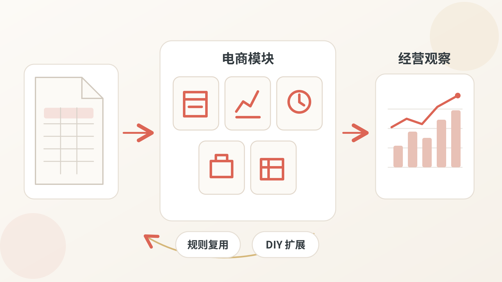
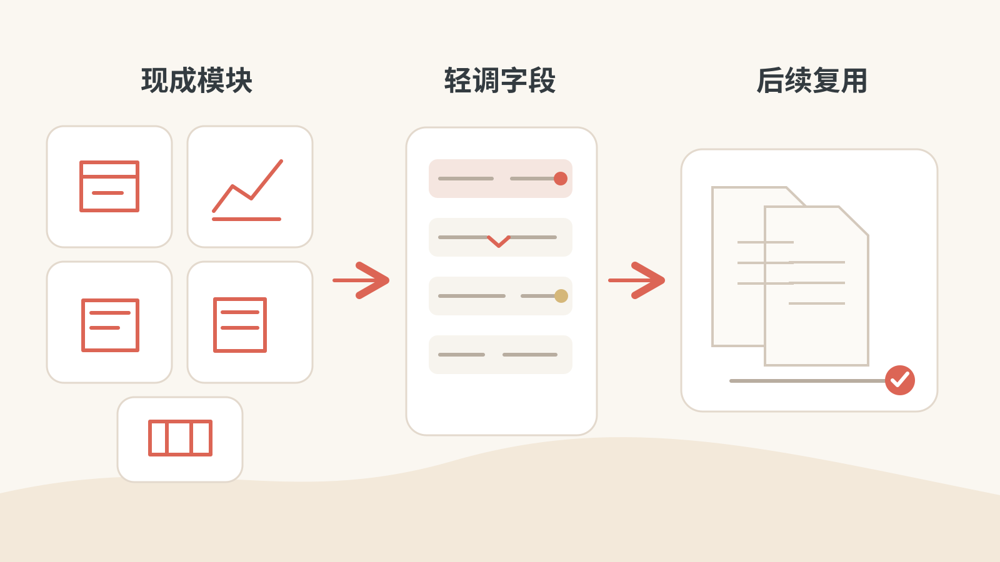
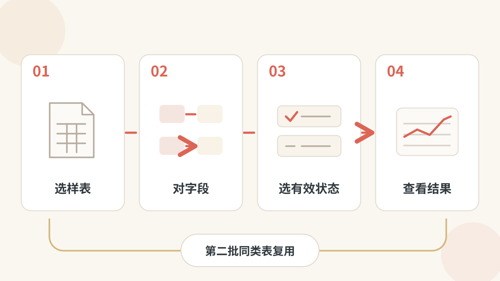
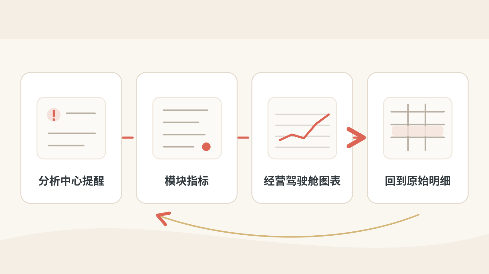

# 轻量电商数据中台

把反复导出的电商报表，整理成能持续复用的业务模块、分析结果和经营观察。



这是一套面向可信电商团队的本地或单租户数据工作台。它从 Excel/CSV 开始：保留原始记录，按业务规则处理，再查看模块指标、分析提醒和图表。重点不是再做一张 Excel，而是把核对过的字段和统计口径留给下一批同类报表。

[从 GitHub 下载并首次启动](docs/GETTING_STARTED.md) · [下载最新版离线包](https://github.com/wangge-dev/ec-data-platform-open/releases/latest) · [新手使用手册](docs/USER_GUIDE.md) · [文档导航](docs/README.md)

## 不知道从哪里开始？把仓库交给 AI

复制下面这段到 ChatGPT 或 Codex，让它先读说明，再带你安装或 DIY。[完整接手提示词与专项模板](docs/AI_PROMPTS.md#0-把仓库交给-ai直接复制)也已备好。

```text
请帮我使用 https://github.com/wangge-dev/ec-data-platform-open 。
先读取 docs/AI_PROMPTS.md 的「0. 把仓库交给 AI」，按其中说明接手。
默认先帮我安装正式版本并用合成样例验证，再按我的报表做 DIY。
先确认你的操作能力、我的电脑环境和已有实例；没有本机工具就分步指导我。
无法读取仓库就请我提供文档，不要猜测；不要索要密码或真实业务数据。
```

AI 可以帮你理解和操作，但不会仅凭一个仓库地址就获得电脑权限。普通业务表优先使用页面向导；复杂改造才需要完整源码。

## 先用现成模块，再按自己的报表调整

项目提供订单、广告、成本、库存和字典等业务入口。已有适配关系的报表可以归入模块；字段名或文件名不同的，先确认映射与归属，再让后续同类文件复用规则。它不会保证任何报表一上传就自动识别正确。



## 普通业务表，也能自己 DIY

不必为每张新表都改代码。页面里的新建模块向导让业务人员选样表、对应字段、选择计入统计的状态，再看处理结果；建议用第二批同类文件验证规则是否真的能复用。复杂跨表关联和特殊计算仍需开发。



## 先发现变化，再回查原因

分析中心汇总提醒，模块工作台提供明细、对比和指标，看板与经营驾驶舱展示已配置的图表。对结果有疑问时，可以回到原始记录和未计入原因核对，而不是只看一张漂亮的图。



平台内业务 AI 是可选能力，需要自行配置模型；它用于分析或文字任务，不会替你修改底层代码。[业务 AI 与开发 AI 的分工](docs/AI_DIY_GUIDE.md)另有说明。

此外，导入时可针对多工作表、1～3 层表头或日期宽表选择处理方式，处理后仍需核对结果。管理员还可把普通模块的**配置方案**带到另一套实例，由接收方接入自己的数据；方案不含业务数据或密码。

## 适用范围与容量

- 普通单表入口：每张表最多 **5 万数据行**。
- 多工作表入口：整本合计最多 **20 万数据行**，且每张表最多 **5 万**。
- 管理员原样 CSV 流式入口：最多 **100 万数据行**。

这是**三种不同入口**，还受文件大小、格式、单元格预算和业务规则限制；并非所有 Excel 都能导入百万行。外部 PostgreSQL/MySQL 入口是管理员授权的受限只读查询，**不是自动同步**。详见[技术与交付说明](docs/TECHNICAL_OVERVIEW.md)。

## 从哪里开始

| 你想做什么 | 入口 |
|---|---|
| 在自己电脑上使用 | 先看[GitHub 下载与首次启动](docs/GETTING_STARTED.md)，再按[新手手册](docs/USER_GUIDE.md)安装；需要 Docker |
| 团队已有部署地址 | 直接用浏览器访问；普通运营人员不必安装 Docker |
| 自己搭建或二次开发 | 看[源码部署指南](docs/部署指南.md)与[技术与交付说明](docs/TECHNICAL_OVERVIEW.md) |
| 复用或扩展业务模块 | 从[页面自助建模块](docs/SELF_SERVICE_MODULES.md)开始；复杂改造再看[AI DIY 指南](docs/AI_DIY_GUIDE.md) |
| 准备团队云服务器 | 由管理员阅读[单租户云工具说明](cloud-kit/README.md)并在目标机验收 |

下载页面自动生成的 **Source code (zip)** 是源码快照，不是可直接启动的离线安装包。GitHub 保存版本；Docker 运行服务；电脑或服务器提供运行机器。

## 使用边界与开源协议

这不是电商平台自动采集器、对陌生客户开放的多租户 SaaS，也不代替财务结账。云服务器准备工具已提供，但真实目标机的公网、HTTPS、备份恢复仍需管理员逐项验收。公开仓库和 Release 不包含真实经营数据库、密码或 API Key；示例数据仅供演示。

项目自有代码按 [GPL-3.0-only](LICENSE) 开源，第三方组件遵循各自许可，见[第三方说明](THIRD_PARTY_NOTICES.md)。问题反馈请先看[安全政策](SECURITY.md)；参与开发请看[贡献指南](CONTRIBUTING.md)。完整资料在[文档索引](docs/README.md)。
